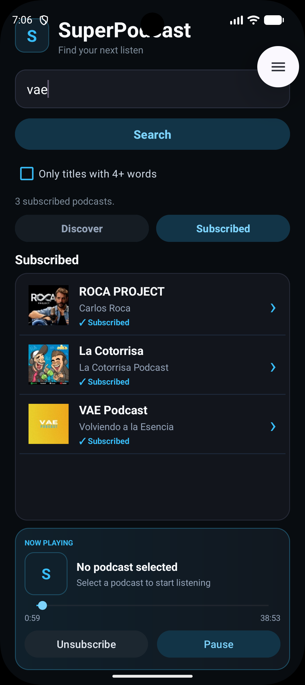
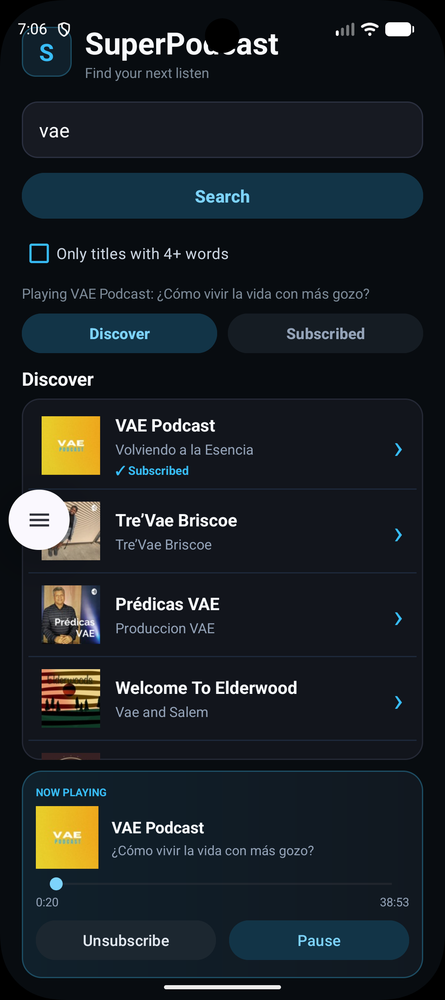

# SuperPodcast - AndroidApp4

SuperPodcast is an Android podcast app completed for Assignment 8. It builds on the networking work from Assignment 7 and uses the iTunes Search API to discover podcasts and load playable episodes.

## Features

- Search for podcasts by name or topic
- Load podcast data from the iTunes Search API
- Display podcast artwork, title, and artist
- Optional filter for podcast titles with 4 or more words
- Select a podcast from the search results
- Subscribe and unsubscribe using SharedPreferences
- View saved podcasts in a dedicated Subscribed section
- Show a visible `✓ Subscribed` indicator in search results
- Load the latest available podcast episode
- Show podcast artwork and episode title in the Now Playing section
- Stream audio using AndroidX Media3 ExoPlayer
- Pause, resume, and replay podcast playback
- Track playback progress with elapsed and total time
- Seek through the episode using the playback progress bar
- Loading, empty-result, and error messages
- Custom dark interface with cyan accents

## Assignment 8 Improvements

Assignment 8 focused on completing and polishing the SuperPodcast app. The interface was redesigned, search results were improved with real podcast artwork, a Subscribed section was added, playback controls were expanded, a playback progress bar was added, and the Now Playing section now displays artwork and the current episode title.

## Screenshots

  
  

## Technologies

- Kotlin
- Android Studio
- iTunes Search API
- JSON
- HttpURLConnection
- SharedPreferences
- AndroidX Media3 ExoPlayer
- Coil image loading library

## Repository

AndroidApp4 / SuperPodcast
